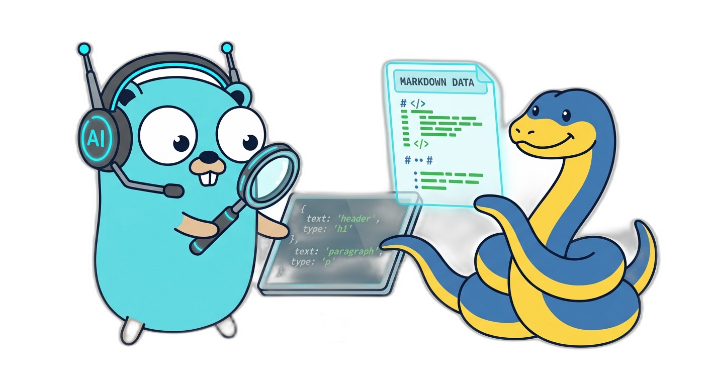

<div align="center">
  
  <h1>Searchbase</h1>
</div>

**SEARCHBASE** is a self-hosted, highly efficient, privacy-focused Search Engine designed explicitly for **AI Agents and LLMs**. 

It natively supports the **Model Context Protocol (MCP)**, making it a plug-and-play web search tool for LLM UIs like Claude Desktop, Cursor, and OpenWebUI.

---

## 🎯 The Mission

In an era where Big AI companies profit from your data and gatekeep intelligence behind expensive token economies, privacy and autonomy have become luxury commodities. While small, local LLMs have the potential to be incredibly powerful, they are currently tethered to proprietary search APIs that demand high subscriptions and offer zero transparency regarding what happens to your queries or agent interactions.

**Searchbase is built to break this cycle.**

Searchbase mission is to provide a sovereign, privacy-first search layer that enables any LLM, regardless of size, to access the live web with maximum efficiency and zero dependency on corporate gatekeepers. Searchbase turns the web into a clean, token-optimized stream of knowledge, ready for your context window.

This repository is my independent open-source project. It will remain separate from any managed cloud service I may build around it.

---

### 📚 **[Read the Full Documentation](https://docs.searchbase.md)**

All documentation is available on the dedicated documentation site. Please visit [docs.searchbase.md](https://docs.searchbase.md) for:
- Installation & Getting Started
- MCP Integration Guides (OpenWebUI, Claude, Cursor)
- REST API Reference
- Configuration & Architecture
- Self-Hosting Instructions

---

## 🎯 Quick Start

### Docker Compose
```bash
git clone https://github.com/coolapso/searchbase.git
cd searchbase
docker compose -f examples/compose/docker-compose.native.yml up
```
The Gateway will be available at `http://localhost:8080`.

The Compose files are demonstration examples only and are not intended for production deployments. See the [Documentation Site](https://docs.searchbase.md) for backend-specific examples and self-hosting notes.

## ⚖️ License

Searchbase is dual-licensed under the **GNU AGPLv3** and a **Commercial License**.

Please see the [Documentation Site](https://docs.searchbase.md) for full details on the business model and license terms.

If you like this project and want to support / contribute in a different way you can always [:heart: Sponsor Me](https://github.com/sponsors/coolapso) or

<a href="https://www.buymeacoffee.com/coolapso" target="_blank">
  
</a>
